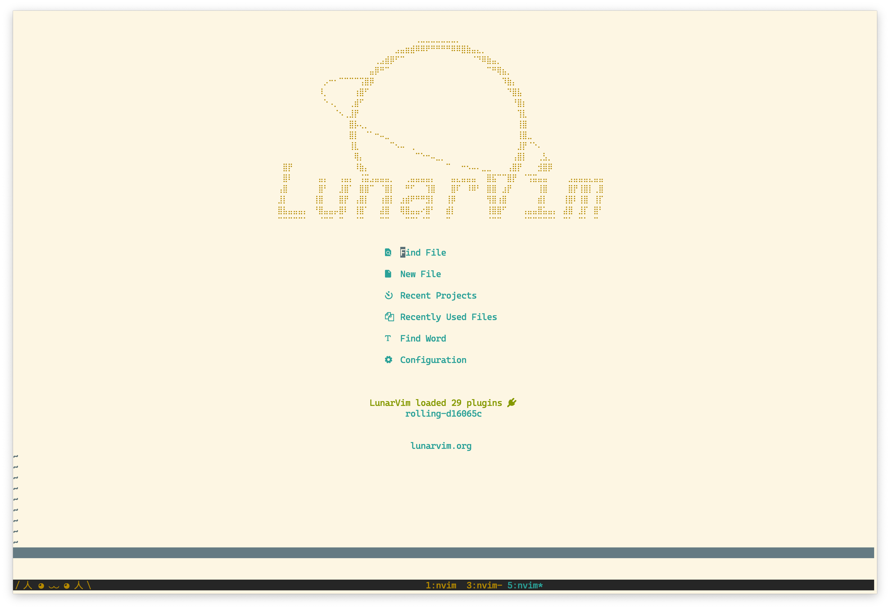

# dotfiles

My ultimate workspace setup: [Alacritty](https://github.com/alacritty/alacritty) + tmux + [LunarVim](https://github.com/LunarVim/LunarVim)

Related config files:

- [Alacritty](./.alacritty.yml)
- [tmux](./.tmux.conf)
- [LunarVim](./config.lua)
